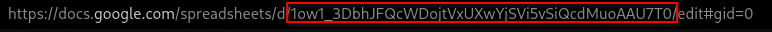

# T-Mail Google Sheets

T-Mail can log readings to a Google Sheet.

## Setup

1.  [Create a project](https://console.cloud.google.com/projectcreate) in the [Google Developer Console](https://console.cloud.google.com/).

2.  [Enable the Google Sheets API](https://developers.google.com/workspace/guides/enable-apis#sheets-api) for your project.

    -   You can do this in the Cloud Console with `gcloud services enable sheets.googleapis.com`

3.  [Set up a Service Account](https://console.developers.google.com/iam-admin/serviceaccounts)

    1. Select the project you previously made if given a selection
    2. Click "Create Service Account"
    3. Fill in the fields. (Service account ID is the only required field )
    4. Click "Create and Continue"
    5. Click "Select a Role" and assign "Editor" permission and select continue, and done after that.
    6. Take note of the email address of the service account you just created.

4.  Create credentials for the Service Account

    1. Click on the service account you just created.
    2. Select the "Keys" tab
    3. Click "Add Key" and select "Create new key"
    4. Select "JSON" and click "Create"
    5. Save the key to the `config` folder of T-Mail as `credentials.json`
        - ⚠️ Never share this file with anyone, it contains the credentials for your Google Cloud Project.

5.  Share the sheet with the service account

        1. Create a new Google Sheet
        2. Click the "Share" button in the top right
        3. Enter the email address of the service account you created in step 3
        4. Click "Send"

6.  Set the config options in `config/config.json`

        1. Set `googleSheets.enabled` to `true`
        2. Fill in `googleSheets.spreadSheetID`, this is the spreadsheet ID from the URL of the sheet you want to use.
        3. Fill in `googleSheets.SheetID`, this is the name of the sheet or page of the entire spreadsheet you want to use
        4. Fill in `googleSheets.topLeftCell`, this is the cell that the data will start being written to. (For example, `A1:D1` will start in the top left corner)
        5. Fill in `googleSheets.data`, [Just like the email system](Email.md) variables are supported.

            - The following variables are available:

                - `%temp%` - The current temperature
                - `%minTemp%` - The lower limit of the safe temperature range
                - `%maxTemp%` - The upper limit of the safe range
                - `%humidity%` - The current humidity
                - `%minHumidity%` - The lower limit of the safe humidity range
                - `%maxHumidity%` - The upper limit of the safe humidity range
                - `%identifier%` - The identifier of the device
                - `%time%` - The time the sensor was checked

    This is the Google Sheets ID:

    
