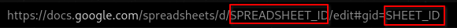

# T-Mail Google Sheets

T-Mail can log readings to a Google Sheet.

## Setup

1.  [Create a project](https://console.cloud.google.com/projectcreate) in the [Google Developer Console](https://console.cloud.google.com/).

2.  [Enable the Google Sheets API](https://developers.google.com/workspace/guides/enable-apis#sheets-api) for your project.

    -   You can do this in the Cloud Console with `gcloud services enable sheets.googleapis.com`

3.  Set up OAuth - You need this to be able to access the Google Sheets API.

    1.  [Create an OAuth Consent Screen](https://console.cloud.google.com/apis/credentials/consent) This is required for projects asking for account credentials.

        1. Select "External" as the user type, unless you have specific reasons otherwise. (Example: You are using a G-Suite account)
        2. Fill in the required fields. (Application name and support email are the only required fields )
        3. Set Scopes - For this project you need the following scopes:
            - `https://www.googleapis.com/auth/spreadsheets`
        4. Add test users - This is required for external users. You can add yourself as a test user by clicking "Add Users" and entering your email address.

    2.  [Create OAuth Credentials](https://console.cloud.google.com/apis/credentials) - This project uses OAuth Credentials for access to Google Sheets.

        1. Click "Create Credentials" and select "OAuth Client ID"
        2. Select "Desktop App" from the Application Type dropdown. The name does not matter.
        3. Download the credentials file and save as `credentials.json` in the config folder of the T-Mail.

4.  Set the config options in `config/config.json`
    1. Set `googleSheets.enabled` to `true`
    2. Fill in `googleSheets.spreadSheetID`, this is the spreadsheet ID from the URL of the sheet you want to use.
    3. Fill in `googleSheets.sheetID`, this is the name of the sheet or page of the entire spreadsheet you want to use

