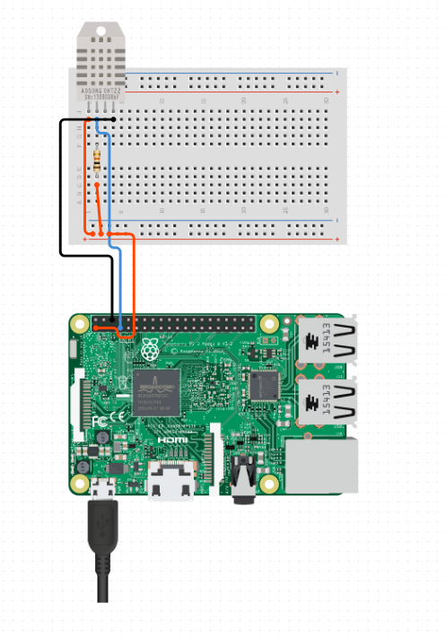
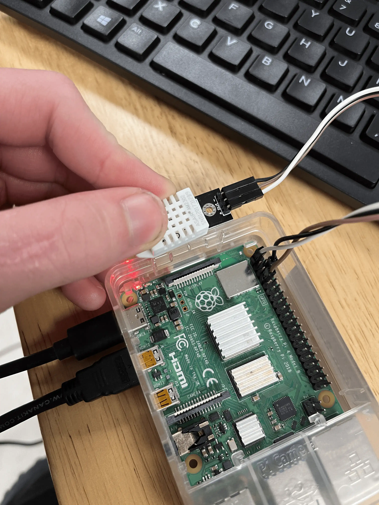

# Sensor Wiring

This is the wiring Diagram for the DHT22 Sensor.

This program was made using the Gowoops DHT22 Temperature Humidity Sensor Module. It is a 3.3V sensor with a pull-up resistor included on board. It can be found on Amazon [here](https://www.amazon.com/Gowoops-Temperature-Humidity-Measurement-Raspberry/dp/B073F472JL).

Wiring for this sensor Counting from the top left pin of GPIO.

(A visual of the GPIO pin numbers can be found at https://pinout.xyz/)

## ⚠️ Warning ⚠️ Do **NOT** use 5V with the Gowoops sensor. It will fry it.

The Amazon page claims that the Gowoops sensor is 5V compatible. This is not true. I have fried 3 sensors attempting to use 5V.

| Sensor  | Pi GPIO        |
| ------- | -------------- |
| **+**   | 3.3V (Pin 1)   |
| **Out** | GPIO 4 (Pin 7) |
| **-**   | Ground (Pin 6) |

